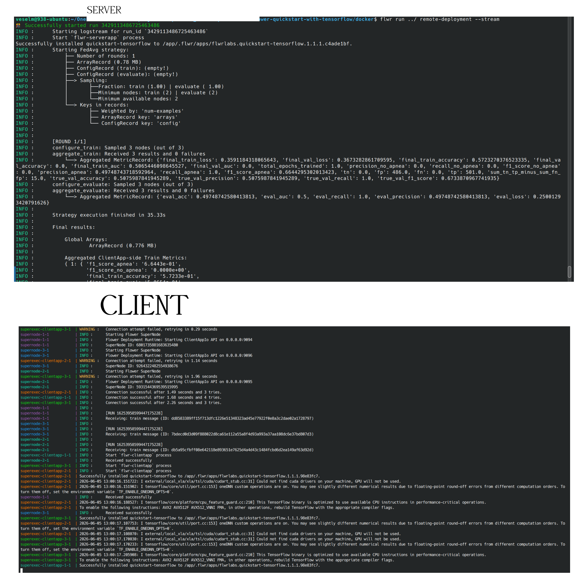

Based on, although slightly adjusted: https://flower.ai/docs/framework/docker/tutorial-deploy-on-multiple-machines.html

# Context
There will be 2 machines:
1. Client machine
2. Server machine

The client machine will contain 3 containers, one for each hospital.
The server machine will act as an aggregator.

# Requirements
The guide was tested on Linux and Windows machines. In case you use Windows, also install Git Bash. It supports all the commands seen below. 

# Setup
## Client
1. `$ git clone git@git.result.si:data-science/federated-learning-poc.git`
1. `$ cd federated-learning-poc/docker`
1. `$ export SUPERLINK_IP=192.168.178.166` Change the IP address to the IP address of the remote machine. Verify the connection with `$ ping 192.168.178.166`. Make sure firewalls, VPNS, etc. are disabled. Make sure you do not leave this terminal session. Make sure that you see the IP address with the command `$ echo SUPERLINK_IP`.

Generate certificates:

1. `$ docker compose -f certs.yml -f complete-certs.yml run --rm --build gen-certs`. A `superlink-certificates` directory will be created, possibly owned by root.
2. `$ sudo tar --create --file=superlink-certificates.tar superlink-certificates`
5. `$ scp -r server superlink-certificates.tar ../pyproject.toml ../LICENSE remote:~/distributed`. This sends 4 required files to the `~/distributed` location on the server machine via SSH. In case you do not have SSH, you can use whatever you want to transfer these files.
6. (Enter the server machine using SSH `$ ssh remote` or manually open the terminal on the remote machine.)

Start clients:
1. `$ export PROJECT_DIR=../../` This is the relative path to the `pyproject.toml` from the location of `client/compose.yml`, which also reads it.
2. `$ docker compose -f client/compose.yml up --build` Have fun observing the logs!

## Server
1. `$ cd ~/distributed`
2. `$ export PROJECT_DIR=../` This is the relative path to the `pyproject.toml` from the location of `server/compose.yml`, which also reads it.
3. (For Linux: `$ mkdir server/state && sudo chown -R 49999:49999 server/state`)
4. (For Windows: Start Docker!)
5. `$ tar --extract --file=superlink-certificates.tar superlink-certificates`
5. `$ docker compose -f server/compose.yml up --build` Have fun observing the server logs!

## Run (Client)
1. `$ cd federated-learning-poc/docker`
2. `$ pip install flwr` Do this either in a virtual environment or globally, it does not matter.
2. `$ flwr config list` You will see the path to the Flower config.
3. Append the following snippet to the Flower config file:
   ```
   [superlink.remote-deployment]
   address = "192.168.178.166:9093"
   root-certificates = "/absolute/path/to/federated-learning-poc/docker/superlink-certificates/ca.crt"
   ```
   Make sure to replace the IP with the one from the remote machine. Keep the port untouched. Also add the absolute path to the `ca.crt` file that you have generated earlier. 
3. `$ flwr run ../ remote-deployment --stream` 

# Sample Output

